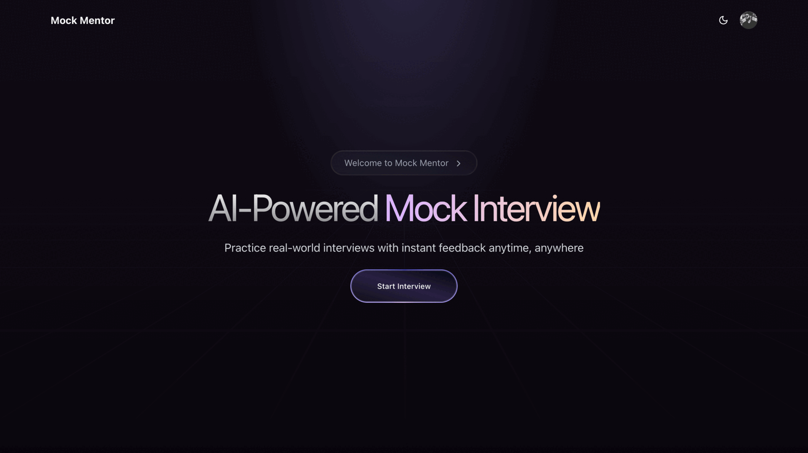
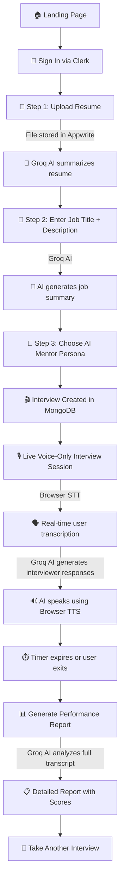

# 🎯 MockMentor — AI-Powered Mock Interview Platform

> Practice real-world interviews with interactive Voice-Only AI models, get instant voice-based feedback, and receive deep performance analytics — all in real time.



---

## 📌 What This Project Does

MockMentor is a full-stack web application that simulates realistic job interviews using AI. A user uploads their resume, enters a job description, selects an AI mentor, and enters a live mock interview conducted entirely by AI via voice. After the session, the system generates a comprehensive performance report with scores, behavioral insights, personality profiling, and actionable recommendations.

**The platform has two main components:**

| Component | Tech | Purpose |
|---|---|---|
| **Web App** (Next.js) | TypeScript, React, Tailwind | The main interview platform — resume upload, real-time voice interview, report generation |
| **Stress Tracker** (Python) | OpenCV, MediaPipe | A standalone computer-vision script that tracks eye blinks, hand movements, and pose to estimate real-time stress levels during an interview |

---

## 🔄 Complete Workflow (Step by Step)



### Detailed Flow:

1. **Authentication** — User signs in via **Clerk** (Google/email).
2. **Resume Upload** — File is uploaded to **Appwrite Storage**. The text content is sent to **Groq AI (LLaMA 3.1 8B)** which generates a concise resume summary. The summary is saved to the **User Profile** in MongoDB.
3. **Job Details** — User enters a job title and optional description. **Groq AI** generates a job summary highlighting key requirements.
4. **Mentor Selection** — User picks from pre-configured mentor personalities.
5. **Interview Session Starts** — An interview record is created in MongoDB. A highly-responsive vocal session initializes using the free Browser STT/TTS loops. **Groq AI** generates a contextual opening/welcome message internally which is read aloud via TTS.
6. **Live Conversation** — The user speaks via microphone. **Web Speech API (STT)** transcribes user speech in real time for free with zero-delays. Transcriptions are sent to **Groq AI** to generate natural interviewer follow-up questions. The AI replies via local **Web Speech Synthesis (TTS)**. All messages, pauses, filler words, and timing metrics are synthesized entirely offline using the transcripts.
7. **Session Ends** — Timer auto-exits at 3 minutes or user manually exits. Final conversation metrics (pause analysis, WPM, filler words, confidence score) are saved.
8. **Report Generation** — The full transcript + behavioral metrics are sent to **Groq AI** with an extensive prompt for executive-level coaching analysis. A detailed report is generated with scores for Communication, Technical Knowledge, Problem Solving, Confidence, and more. 

---

## 🔑 API Keys & Services — What Each One Does

| Environment Variable | Service | What It's Used For | Required? |
|---|---|---|---|
| `MONGODB_URI` | [MongoDB Atlas](https://www.mongodb.com/atlas) | Stores user profiles, interviews, sessions, messages, metrics, and reports | ✅ Yes |
| `NEXT_PUBLIC_CLERK_PUBLISHABLE_KEY` | [Clerk](https://clerk.com/) | User authentication (sign-in/sign-up) — client side | ✅ Yes |
| `CLERK_SECRET_KEY` | [Clerk](https://clerk.com/) | User authentication — server side middleware | ✅ Yes |
| `GROQ_API_KEY` | [Groq](https://groq.com/) | **Primary AI engine** — Powers resume summarization, job analysis, real-time interview conversation, and full report generation. Uses `llama-3.1-8b-instant` | ✅ Yes |
| `NEXT_PUBLIC_APPWRITE_ENDPOINT` | [Appwrite](https://appwrite.io/) | Cloud backend for file storage (resume uploads) | ✅ Yes |
| `NEXT_PUBLIC_APPWRITE_PROJECT_ID` | Appwrite | Identifies your Appwrite project | ✅ Yes |
| `NEXT_PUBLIC_BUCKET_ID` | Appwrite | Appwrite Storage bucket for resume files | ✅ Yes |
| `GEMINI_API_KEY` | [Google Gemini](https://aistudio.google.com/) | Currently configured but **not actively used** in code routes — Groq handles all AI tasks | ❌ Optional |

### Which AI does what?

```text
┌─────────────────────────────────────────────────────────────────┐
│                     AI SERVICE MAPPING                          │
├─────────────────────┬───────────────────────────────────────────┤
│  Groq (LLaMA 3.1)  │  Resume summarization                    │
│                     │  Job description analysis                │
│                     │  Real-time interview Q&A generation      │
│                     │  Welcome message generation              │
│                     │  Full performance report analysis        │
│                     │  Per-question STAR method scoring         │
├─────────────────────┼───────────────────────────────────────────┤
│  Browser Web Speech │  Speech-to-Text (STT): Real-time speech  │
│  API                │  Text-to-Speech (TTS): Speaking AI Voice │
└─────────────────────┴───────────────────────────────────────────┘
```

---

## 🐍 Python Stress Tracker (`model/new.py`)

A standalone computer-vision script that uses your webcam to track real-time interview stress levels. This is **separate from the web app** and runs independently.

### What it does:
- **Face Detection** — Tracks 468 facial landmarks via MediaPipe to calculate Eye Aspect Ratio (EAR) and blink rate
- **Hand Tracking** — Monitors hand movement patterns (fidgeting detection)
- **Pose Estimation** — Tracks body posture and movement
- **Stress Scoring** — Combines EAR drop + blink frequency + hand movement into a composite stress score
- **Real-time Display** — Shows stress state (RELAXED / SLIGHTLY NERVOUS / STRESSED) on the camera feed

### How to run it:

```bash
cd model
pip install -r requirements.txt    # opencv-python, mediapipe, numpy
python new.py                      # Opens webcam — press ESC to quit
```

> **Note:** Requires a webcam. The first run downloads ~30MB of MediaPipe model files.

---

## 🛠️ Tech Stack

| Layer | Technology |
|---|---|
| **Framework** | Next.js 15 (App Router, Turbopack) |
| **Language** | TypeScript, React 19 |
| **Styling** | Tailwind CSS v4 |
| **UI Components** | Radix UI (Dialog, Progress, ScrollArea), Lucide icons |
| **Authentication** | Clerk |
| **Database** | MongoDB Atlas + Mongoose |
| **File Storage** | Appwrite Cloud Storage |
| **AI / LLM** | Groq (LLaMA 3.1 8B Instant) via Vercel AI SDK |
| **Voice (TTS/STT)** | Native Browser Web Speech API |
| **CV / Stress** | Python, OpenCV, MediaPipe |

---

## 📁 Project Structure

```text
NexHack-Pro/
├── app/
│   ├── page.tsx                    # Landing page (Hero, Mentors, Features)
│   ├── layout.tsx                  # Root layout with Clerk + theme providers
│   ├── globals.css                 # Global styles
│   ├── interview/
│   │   ├── new/page.tsx            # 3-step interview setup wizard
│   │   └── [id]/page.tsx           # Voice-Only live interview session page
│   ├── report/
│   │   └── [id]/page.tsx           # Performance report viewer
│   └── api/
│       ├── upload-resume/          # Uploads resume to Appwrite + Groq summary
│       ├── process-resume/         # Processes resume text with Groq AI
│       ├── process-job/            # Generates job summary with Groq AI
│       ├── create-interview/       # Creates interview in MongoDB
│       ├── interview-session/      # Manage session lifecycle + messages
│       ├── ai-chat/                # Real-time Groq AI conversation responses
│       ├── generate-report/        # Full AI report generation
│       └── user-profile/           # User profile CRUD
├── components/
│   ├── interview.tsx               # Main interview UI (audio visualizer)
│   ├── interview-complete.tsx      # Post-interview completion screen
│   ├── interview-report.tsx        # Report display with scores + charts
│   ├── logic/                      # Orchestration for AI voice lifecycle
│   │   ├── VoiceInterviewContext.tsx
│   │   └── useVoiceInterview.ts 
│   └── ui/                         # Radix UI component wrappers
├── hooks/
│   ├── useSpeechToText.ts          # Native Browser Speech-to-Text hooks
│   └── useTextToSpeech.ts          # Native Browser Text-to-Speech hooks
├── lib/
│   ├── mongodb.ts                  # MongoDB connection helper
│   ├── appwrite.ts                 # Appwrite file storage client
│   └── models/                     # Mongoose schemas
│       ├── User.ts                 # User profile (resume data)
│       ├── InterviewSession.ts     # Session messages + metrics
│       └── InterviewReport.ts      # Generated report data
├── model/                          # Python stress tracker (standalone)
│   ├── new.py                      # CV-based stress detection script
│   └── requirements.txt           # Python dependencies
├── .env.local                      # API keys (DO NOT COMMIT)
└── package.json                    # Node.js dependencies
```

---

## 🏃‍♂️ Quick Start

### Prerequisites
- Node.js 18+
- npm
- MongoDB Atlas account
- API keys for Clerk, Groq, and Appwrite (see table above)

### 1. Clone & Install

```bash
git clone <repository-url>
cd NexHack-Pro
npm install
```

### 2. Configure Environment

```bash
cp .env.example .env.local
```

Edit `.env.local` and fill in all **required** API keys (see the API Keys table above). Note: Keys like `HEYGEN_API_KEY` are obsolete and no longer needed for voice routing!

### 3. Run the Development Server

```bash
npm run dev
```

Open [http://localhost:3000](http://localhost:3000) in your browser. Note: Voice-Only API works best on modern desktop browsers (Chrome, Edge).

---

## 📊 Report Features

After completing an interview, the generated report includes:

- **Overall Score** (0–100) with hiring recommendation
- **Performance Analysis**: Communication Skills, Technical Knowledge, Problem Solving, Confidence
- **Behavioral Insights**: Pause analysis, speech pace, filler word frequency, confidence analysis
- **Personality Profiling** (Big Five): Openness, Conscientiousness, Extraversion, Agreeableness, Neuroticism
- **Per-Question Feedback**: STAR method alignment, dimension scores, red flags, improvement strategies
- **Recommendations**: Immediate actions, short-term goals (30–90 days), long-term development (6–12 months)

---

## 🔮 Future Enhancements

- Full integration of Python stress tracker with the web app via WebSocket
- Extended interview durations and industry-specific modules
- Team/panel interview simulations
- Historical performance tracking and progress dashboards
- Export reports as PDF

---

**Built for NexHack by Team Algorhythm** 🚀
