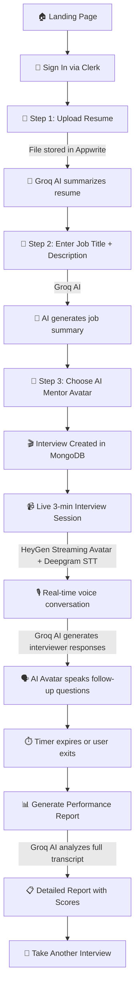

# 🎯 MockMentor — AI-Powered Mock Interview Platform

> Practice real-world interviews with lifelike AI avatars, get instant voice-based feedback, and receive deep performance analytics — all in real time.


---

## 📌 What This Project Does

MockMentor is a full-stack web application that simulates realistic job interviews using AI. A user uploads their resume, enters a job description, selects an AI mentor (video avatar), and enters a 3-minute live mock interview conducted entirely by AI. After the session, the system generates a comprehensive performance report with scores, behavioral insights, personality profiling, and actionable recommendations.

**The platform has two main components:**

| Component | Tech | Purpose |
|---|---|---|
| **Web App** (Next.js) | TypeScript, React, Tailwind | The main interview platform — resume upload, live avatar interview, report generation |
| **Stress Tracker** (Python) | OpenCV, MediaPipe | A standalone computer-vision script that tracks eye blinks, hand movements, and pose to estimate real-time stress levels during an interview |

---

## 🔄 Complete Workflow (Step by Step)



### Detailed Flow:

1. **Authentication** — User signs in via **Clerk** (Google/email).
2. **Resume Upload** — File is uploaded to **Appwrite Storage**. The text content is sent to **Groq AI (LLaMA 3.1 8B)** which generates a concise resume summary. The summary is saved to the **User Profile** in MongoDB.
3. **Job Details** — User enters a job title and optional description. **Groq AI** generates a job summary highlighting key requirements.
4. **Mentor Selection** — User picks from 6 pre-configured HeyGen avatar personalities (Elenora, Judy, June, Silas, Bryan, Wayne).
5. **Interview Session Starts** — An interview record is created in MongoDB. A **HeyGen Streaming Avatar** session is initialized with a streaming token. **Groq AI** generates a contextual opening/welcome message which the avatar speaks aloud.
6. **Live Conversation (3 minutes)** — The user speaks via microphone. **Deepgram STT** transcribes user speech in real time. Transcriptions are sent to **Groq AI** to generate natural interviewer follow-up questions. The **HeyGen Avatar** speaks the AI response using **ElevenLabs** voice synthesis. All messages, pauses, filler words, and timing metrics are recorded in MongoDB.
7. **Session Ends** — Timer auto-exits at 3 minutes or user manually exits. Final conversation metrics (pause analysis, WPM, filler words, confidence score) are saved.
8. **Report Generation** — The full transcript + behavioral metrics are sent to **Groq AI** with an extensive prompt for executive-level coaching analysis. Optionally, **Imentiv AI** analyzes video emotions (if API key provided). A detailed report is generated with scores for Communication, Technical Knowledge, Problem Solving, Confidence, and more. The report is saved to MongoDB and displayed in the UI.

---

## 🔑 API Keys & Services — What Each One Does

| Environment Variable | Service | What It's Used For | Required? |
|---|---|---|---|
| `MONGODB_URI` | [MongoDB Atlas](https://www.mongodb.com/atlas) | Stores user profiles, interviews, sessions, messages, metrics, and reports | ✅ Yes |
| `NEXT_PUBLIC_CLERK_PUBLISHABLE_KEY` | [Clerk](https://clerk.com/) | User authentication (sign-in/sign-up) — client side | ✅ Yes |
| `CLERK_SECRET_KEY` | [Clerk](https://clerk.com/) | User authentication — server side middleware | ✅ Yes |
| `GROQ_API_KEY` | [Groq](https://groq.com/) | **Primary AI engine** — Powers resume summarization, job analysis, real-time interview conversation, and full report generation. Uses `llama-3.1-8b-instant` model via Vercel AI SDK | ✅ Yes |
| `HEYGEN_API_KEY` | [HeyGen](https://www.heygen.com/) | Streaming video avatar that conducts the interview. Provides lifelike talking head with lip-sync | ✅ Yes |
| `NEXT_PUBLIC_BASE_API_URL` | HeyGen | Base URL for HeyGen API (`https://api.heygen.com`) | ✅ Yes |
| `NEXT_PUBLIC_APPWRITE_ENDPOINT` | [Appwrite](https://appwrite.io/) | Cloud backend for file storage (resume uploads) | ✅ Yes |
| `NEXT_PUBLIC_APPWRITE_PROJECT_ID` | Appwrite | Identifies your Appwrite project | ✅ Yes |
| `NEXT_PUBLIC_BUCKET_ID` | Appwrite | Appwrite Storage bucket for resume files | ✅ Yes |
| `GEMINI_API_KEY` | [Google Gemini](https://aistudio.google.com/) | Currently configured but **not actively used** in code routes — Groq handles all AI tasks | ❌ Optional |
| `OPENAI_API_KEY` | [OpenAI](https://platform.openai.com/) | Package installed (`openai`) but **not actively used** in current API routes | ❌ Optional |
| `IMENTIV_API_KEY` | [Imentiv AI](https://imentiv.ai/) | Video emotion analysis — facial expression tracking, personality insights, authenticity scoring. Falls back to synthetic metrics if not provided | ❌ Optional |

### Which AI does what?

```
┌─────────────────────────────────────────────────────────────────┐
│                     AI SERVICE MAPPING                          │
├─────────────────────┬───────────────────────────────────────────┤
│  Groq (LLaMA 3.1)  │  Resume summarization                    │
│                     │  Job description analysis                │
│                     │  Real-time interview Q&A generation      │
│                     │  Welcome message generation              │
│                     │  Full performance report analysis        │
│                     │  Per-question STAR method scoring         │
├─────────────────────┼───────────────────────────────────────────┤
│  HeyGen             │  Streaming video avatar (visual face)    │
│                     │  Avatar lip-sync and speaking            │
├─────────────────────┼───────────────────────────────────────────┤
│  ElevenLabs         │  Voice synthesis (via HeyGen)            │
│  (eleven_flash_v2)  │  Text-to-speech for avatar responses     │
├─────────────────────┼───────────────────────────────────────────┤
│  Deepgram           │  Speech-to-text (via HeyGen STT)         │
│                     │  Real-time user speech transcription      │
├─────────────────────┼───────────────────────────────────────────┤
│  Imentiv AI         │  Video emotion analysis (optional)       │
│  (optional)         │  Facial expression + personality traits   │
└─────────────────────┴───────────────────────────────────────────┘
```

---

## 🐍 Python Stress Tracker (`model/new.py`)

A standalone computer-vision script that uses your webcam to track real-time interview stress levels. This is **separate from the web app** and runs independently.

### What it does:
- **Face Detection** — Tracks 468 facial landmarks via MediaPipe to calculate Eye Aspect Ratio (EAR) and blink rate
- **Hand Tracking** — Monitors hand movement patterns (fidgeting detection)
- **Pose Estimation** — Tracks body posture and movement
- **Stress Scoring** — Combines EAR drop + blink frequency + hand movement into a composite stress score
- **Real-time Display** — Shows stress state (RELAXED / SLIGHTLY NERVOUS / STRESSED) on the camera feed

### How to run it:

```bash
cd model
pip install -r requirements.txt    # opencv-python, mediapipe, numpy
python new.py                      # Opens webcam — press ESC to quit
```

> **Note:** Requires a webcam. The first run downloads ~30MB of MediaPipe model files.

---

## 🛠️ Tech Stack

| Layer | Technology |
|---|---|
| **Framework** | Next.js 15 (App Router, Turbopack) |
| **Language** | TypeScript, React 19 |
| **Styling** | Tailwind CSS v4 |
| **UI Components** | Radix UI (Dialog, Avatar, Progress, ScrollArea), Lucide icons |
| **Authentication** | Clerk |
| **Database** | MongoDB Atlas + Mongoose |
| **File Storage** | Appwrite Cloud Storage |
| **AI / LLM** | Groq (LLaMA 3.1 8B Instant) via Vercel AI SDK |
| **Avatar** | HeyGen Streaming Avatar API |
| **Voice (TTS)** | ElevenLabs (via HeyGen) |
| **Voice (STT)** | Deepgram (via HeyGen) |
| **Emotion Analysis** | Imentiv AI (optional) |
| **CV / Stress** | Python, OpenCV, MediaPipe |

---

## 📁 Project Structure

```
NexHack-Pro/
├── app/
│   ├── page.tsx                    # Landing page (Hero, Mentors, Features)
│   ├── layout.tsx                  # Root layout with Clerk + theme providers
│   ├── globals.css                 # Global styles
│   ├── interview/
│   │   ├── new/page.tsx            # 3-step interview setup wizard
│   │   └── [id]/page.tsx           # Live interview session page
│   ├── report/
│   │   └── [id]/page.tsx           # Performance report viewer
│   └── api/
│       ├── get-access-token/       # Fetches HeyGen streaming token
│       ├── upload-resume/          # Uploads resume to Appwrite + Groq summary
│       ├── process-resume/         # Processes resume text with Groq AI
│       ├── process-job/            # Generates job summary with Groq AI
│       ├── create-interview/       # Creates interview in MongoDB
│       ├── interview/[id]/         # Fetch interview by ID
│       ├── interview-session/      # Manage session lifecycle + messages
│       ├── ai-chat/                # Real-time Groq AI conversation responses
│       ├── generate-report/        # Full AI report generation (875 lines)
│       └── user-profile/           # User profile CRUD
├── components/
│   ├── interview.tsx               # Main interview UI (avatar + user video)
│   ├── interview-complete.tsx      # Post-interview completion screen
│   ├── interview-report.tsx        # Report display with scores + charts
│   ├── mentors.tsx                 # Mentor avatar definitions
│   ├── hero-section.tsx            # Landing page hero
│   ├── features-section.tsx        # Features showcase
│   ├── logic/                      # HeyGen streaming avatar hooks
│   │   ├── context.tsx             # StreamingAvatar React context
│   │   ├── useStreamingAvatarSession.ts
│   │   ├── useVoiceChat.ts
│   │   └── useTextChat.ts
│   └── ui/                         # Radix UI component wrappers
├── lib/
│   ├── mongodb.ts                  # MongoDB connection helper
│   ├── appwrite.ts                 # Appwrite file storage client
│   ├── appConfig.ts                # App title configuration
│   └── models/                     # Mongoose schemas
│       ├── User.ts                 # User profile (resume data)
│       ├── Interview.ts            # Interview metadata
│       ├── InterviewSession.ts     # Session messages + metrics
│       └── InterviewReport.ts      # Generated report data
├── model/                          # Python stress tracker (standalone)
│   ├── new.py                      # CV-based stress detection script
│   └── requirements.txt           # Python dependencies
├── middleware.ts                   # Clerk auth middleware
├── .env.local                      # API keys (DO NOT COMMIT)
└── package.json                    # Node.js dependencies
```

---

## 🏃‍♂️ Quick Start

### Prerequisites
- Node.js 18+
- npm
- MongoDB Atlas account
- API keys for Clerk, Groq, HeyGen, and Appwrite (see table above)

### 1. Clone & Install

```bash
git clone <repository-url>
cd NexHack-Pro
npm install
```

### 2. Configure Environment

```bash
cp .env.example .env.local
```

Edit `.env.local` and fill in all **required** API keys (see the API Keys table above).

### 3. Run the Development Server

```bash
npm run dev
```

Open [http://localhost:3000](http://localhost:3000) in your browser.

### 4. (Optional) Run the Stress Tracker

```bash
cd model
pip install -r requirements.txt
python new.py
```

---

## 📊 Report Features

After completing an interview, the generated report includes:

- **Overall Score** (0–100) with hiring recommendation
- **Performance Analysis**: Communication Skills, Technical Knowledge, Problem Solving, Confidence, Body Language
- **Behavioral Insights**: Pause analysis, speech pace, confidence analysis, emotional state
- **Personality Profiling** (Big Five): Openness, Conscientiousness, Extraversion, Agreeableness, Neuroticism
- **Per-Question Feedback**: STAR method alignment, dimension scores, red flags, improvement strategies
- **Recommendations**: Immediate actions, short-term goals (30–90 days), long-term development (6–12 months)

---

## 🔮 Future Enhancements

- Full integration of Python stress tracker with the web app via WebSocket
- Extended interview durations and industry-specific modules
- Team/panel interview simulations
- Historical performance tracking and progress dashboards
- Export reports as PDF

---

**Built for NexHack by Team Algorhythm** 🚀
