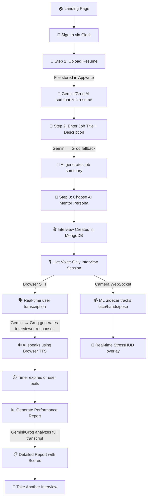

# 🎯 MockMentor — AI-Powered Mock Interview Platform

> Practice real-world interviews with interactive Voice-Only AI, get real-time stress & emotion tracking via computer vision, and receive deep performance analytics — all in your browser.


---

## 🚀 Live & Deployed

MockMentor is **fully deployed and production-ready**:

| Service | Platform | Status |
|---|---|---|
| **Web App** (Next.js 15) | Vercel | ✅ Live |
| **ML Sidecar** (FastAPI + MediaPipe) | Render (Docker) | ✅ Live |
| **Database** | MongoDB Atlas | ✅ Connected |
| **Auth** | Clerk | ✅ Active |
| **File Storage** | Appwrite Cloud | ✅ Active |

---

## 📌 What This Project Does

MockMentor is a full-stack web application that simulates realistic job interviews using AI. A user uploads their resume, enters a job description, selects an AI mentor, and enters a live mock interview conducted entirely by AI via voice. During the session, a computer-vision ML pipeline tracks the candidate's stress, emotions, gaze, and body language in real time. After the session, the system generates a comprehensive performance report with scores, behavioral insights, personality profiling, and actionable recommendations.

**The platform has two integrated components:**

| Component | Tech | Purpose |
|---|---|---|
| **Web App** (Next.js) | TypeScript, React 19, Tailwind v4 | The main interview platform — resume upload, real-time voice interview, report generation |
| **ML Sidecar** (Python) | FastAPI, MediaPipe, OpenCV | Real-time computer-vision pipeline — stress scoring, emotion classification, gaze tracking, blink detection, fidget analysis, posture estimation via WebSocket |

---

## 🔄 Complete Workflow (Step by Step)



### Detailed Flow:

1. **Authentication** — User signs in via **Clerk** (Google/email).
2. **Resume Upload** — File is uploaded to **Appwrite Storage**. The text content is sent to **Gemini AI** (with Groq fallback) which generates a concise resume summary. The summary is saved to the **User Profile** in MongoDB.
3. **Job Details** — User enters a job title and optional description. **Gemini/Groq AI** generates a job summary highlighting key requirements.
4. **Mentor Selection** — User picks from pre-configured mentor personalities.
5. **Interview Session Starts** — An interview record is created in MongoDB. A vocal session initializes using the free Browser STT/TTS loops. **Gemini/Groq AI** generates a contextual welcome message which is read aloud via TTS.
6. **Live Conversation** — The user speaks via microphone. **Web Speech API (STT)** transcribes user speech in real time with zero-latency. Transcriptions are sent to **Gemini AI** (Groq fallback) to generate natural interviewer follow-up questions. The AI replies via local **Web Speech Synthesis (TTS)**. All messages, pauses, filler words, and timing metrics are synthesized entirely offline using the transcripts.
7. **Real-time CV Tracking** — Simultaneously, the `useFaceTracker` hook captures camera frames at 4 fps, sends them via WebSocket to the **ML Sidecar** (FastAPI on Render), which runs the full MediaPipe pipeline and returns per-frame stress/emotion/gaze data. The **StressHUD** component renders this as a live overlay.
8. **Session Ends** — Timer auto-exits at 3 minutes or user manually exits. Final conversation metrics (pause analysis, WPM, filler words, confidence score) and ML session summary are saved.
9. **Report Generation** — The full transcript + behavioral metrics are sent to **Gemini AI** (Groq fallback) with an extensive prompt for executive-level coaching analysis. A detailed report is generated with scores for Communication, Technical Knowledge, Problem Solving, Confidence, and more.

---

## 🔑 API Keys & Services — What Each One Does

| Environment Variable | Service | What It's Used For | Required? |
|---|---|---|---|
| `MONGODB_URI` | [MongoDB Atlas](https://www.mongodb.com/atlas) | Stores user profiles, interviews, sessions, messages, metrics, and reports | ✅ Yes |
| `NEXT_PUBLIC_CLERK_PUBLISHABLE_KEY` | [Clerk](https://clerk.com/) | User authentication (sign-in/sign-up) — client side | ✅ Yes |
| `CLERK_SECRET_KEY` | [Clerk](https://clerk.com/) | User authentication — server side middleware | ✅ Yes |
| `GEMINI_API_KEY` | [Google AI](https://ai.google.dev/) | **Primary AI engine** — Resume summarization, job analysis, real-time interview conversation, and full performance report generation. Uses Gemini 2.0 Flash with multi-model fallback | ✅ Yes |
| `GROQ_API_KEY` | [Groq](https://groq.com/) | **Fallback AI engine** — All the same AI tasks, activated when Gemini is rate-limited (429) or unavailable. Uses LLaMA 3.1 8B → LLaMA 3.3 70B fallback chain | ✅ Yes |
| `NEXT_PUBLIC_APPWRITE_ENDPOINT` | [Appwrite](https://appwrite.io/) | Cloud backend for file storage (resume uploads) | ✅ Yes |
| `NEXT_PUBLIC_APPWRITE_PROJECT_ID` | Appwrite | Identifies your Appwrite project | ✅ Yes |
| `NEXT_PUBLIC_BUCKET_ID` | Appwrite | Appwrite Storage bucket for resume files | ✅ Yes |
| `NEXT_PUBLIC_ML_SIDECAR_URL` | ML Sidecar (Render) | URL of the deployed ML sidecar for real-time face tracking | ⚡ Optional |

### Which AI / ML does what?

```text
┌─────────────────────────────────────────────────────────────────────────────────┐
│                           AI / ML SERVICE MAPPING                               │
├──────────────────────────┬──────────────────────────────────────────────────────┤
│  Gemini 2.0 Flash        │  Primary: resume summary, job analysis,             │
│  (→ 1.5 Flash → 1.5 Pro) │  interview Q&A, welcome message, report generation  │
├──────────────────────────┼──────────────────────────────────────────────────────┤
│  Groq (LLaMA 3.1 8B      │  Fallback: all the same tasks when Gemini           │
│  → LLaMA 3.3 70B)        │  is rate-limited or unavailable                     │
├──────────────────────────┼──────────────────────────────────────────────────────┤
│  Browser Web Speech API   │  Speech-to-Text (STT): zero-latency transcription  │
│                          │  Text-to-Speech (TTS): AI voice output              │
├──────────────────────────┼──────────────────────────────────────────────────────┤
│  MediaPipe (ML Sidecar)  │  Face landmarks (468 pts), hand tracking (21 pts),  │
│  Python / FastAPI        │  pose estimation (33 pts), 7-class emotions,        │
│  Deployed on Render      │  blink/EAR, gaze, fidget, posture, stress scoring   │
└──────────────────────────┴──────────────────────────────────────────────────────┘
```

---

## 🧠 ML Sidecar — Real-time Computer Vision (`model/`)

A production-deployed **FastAPI WebSocket server** that processes camera frames through a modular MediaPipe pipeline and returns per-frame behavioral analysis. Deployed on **Render** as a Docker container.

### What it tracks:

| Signal | Module | Description |
|---|---|---|
| **Face Landmarks** | `face.py` | 468-point mesh via MediaPipe FaceLandmarker |
| **Eye Aspect Ratio** | `face.py` | EAR calculation for precise blink detection |
| **Emotions** | `emotion.py` | 7-class classifier (happy, sad, angry, surprised, fear, disgust, neutral) from blendshapes |
| **Gaze Direction** | `gaze.py` | Iris-based offset to determine if user is looking at screen |
| **Head Pose** | `pose.py` | Yaw, pitch, roll decomposition from facial transformation matrix |
| **Hand Fidgeting** | `hands.py` | Movement magnitude + fidget level (still/moderate/high) |
| **Body Posture** | `pose.py` | Shoulder tilt + lean direction (upright/forward/backward) |
| **Stress Score** | `stress.py` | 0–10 composite score from EAR, blinks, fidget, emotions, gaze |
| **Meta-signals** | `stress.py` | Engagement, confidence, attention (all 0–1) |
| **Smoothing** | `smoothing.py` | EMA + windowed filters for stable signal output |

### Calibration:

The pipeline auto-calibrates for the first **90 frames** — user sits naturally while baseline EAR and hand movement are measured. All subsequent stress scoring is relative to the user's personal baseline.

### Architecture:

```
Browser camera → useFaceTracker hook → WebSocket → server.py → Pipeline → FrameResult → StressHUD
                 (4 fps, JPEG, 320×240)             (FastAPI)   (tracker/)  (schema.py)   (React)
```

### How to run locally:

```bash
cd model
pip install -r requirements.txt
python server.py                    # Starts on http://localhost:8001
```

> The server includes a built-in debug dashboard at `/` with live camera preview, stress bars, emotion charts, and all raw signals.

### How to run standalone (no server):

```bash
cd model
python new.py                       # Opens webcam — press ESC to quit
```

---

## 🛠️ Tech Stack

| Layer | Technology |
|---|---|
| **Framework** | Next.js 15 (App Router, Turbopack) |
| **Language** | TypeScript, React 19 |
| **Styling** | Tailwind CSS v4 |
| **UI Components** | Radix UI (Dialog, Progress, ScrollArea), Lucide icons |
| **Authentication** | Clerk |
| **Database** | MongoDB Atlas + Mongoose |
| **File Storage** | Appwrite Cloud Storage |
| **AI / LLM** | Gemini 2.0 Flash + Groq (LLaMA 3.1/3.3) via Vercel AI SDK |
| **Voice (TTS/STT)** | Native Browser Web Speech API |
| **CV / ML Sidecar** | Python 3.11, FastAPI, MediaPipe ≥ 0.10.14, OpenCV |
| **ML Deployment** | Docker on Render (free tier, Mesa software renderer) |

---

## 📁 Project Structure

```text
MockMentor/
├── app/
│   ├── page.tsx                    # Landing page (Hero, Mentors, Features)
│   ├── layout.tsx                  # Root layout with Clerk + theme providers
│   ├── globals.css                 # Global styles
│   ├── interview/
│   │   ├── new/page.tsx            # 3-step interview setup wizard
│   │   └── [id]/page.tsx           # Voice-Only live interview session page
│   ├── report/
│   │   └── [id]/page.tsx           # Performance report viewer
│   └── api/
│       ├── upload-resume/          # Uploads resume to Appwrite + AI summary
│       ├── process-resume/         # Processes resume text with Gemini/Groq
│       ├── process-job/            # Generates job summary with Gemini/Groq
│       ├── create-interview/       # Creates interview in MongoDB
│       ├── interview-session/      # Manage session lifecycle + messages
│       ├── ai-chat/                # Real-time Gemini/Groq conversation
│       ├── generate-report/        # Full AI report generation
│       └── user-profile/           # User profile CRUD
├── components/
│   ├── interview.tsx               # Main interview UI (audio visualizer)
│   ├── interview-complete.tsx      # Post-interview completion screen
│   ├── interview-report.tsx        # Report display with scores + charts
│   ├── interview/
│   │   └── StressHUD.tsx           # Real-time stress/emotion/gaze overlay
│   ├── logic/                      # Orchestration for AI voice lifecycle
│   │   ├── VoiceInterviewContext.tsx
│   │   └── useVoiceInterview.ts
│   └── ui/                         # Radix UI component wrappers
├── hooks/
│   ├── useSpeechToText.ts          # Native Browser Speech-to-Text hook
│   ├── useTextToSpeech.ts          # Native Browser Text-to-Speech hook
│   └── useFaceTracker.ts           # WebSocket bridge → ML sidecar
├── lib/
│   ├── gemini.ts                   # Gemini AI client (multi-model fallback)
│   ├── groq.ts                     # Groq AI client (multi-model fallback)
│   ├── mlSidecar.ts                # ML sidecar URL config + TypeScript types
│   ├── mongodb.ts                  # MongoDB connection helper
│   ├── appwrite.ts                 # Appwrite file storage client
│   ├── prompts.json                # Centralized AI prompts (editable)
│   ├── promptHelper.ts             # Prompt loading utilities
│   ├── pdf.ts                      # PDF text extraction
│   └── models/                     # Mongoose schemas
│       ├── User.ts
│       ├── Interview.ts
│       ├── InterviewSession.ts
│       └── InterviewReport.ts
├── model/                          # Python ML Sidecar (deployed on Render)
│   ├── server.py                   # FastAPI WebSocket server + debug dashboard
│   ├── schema.py                   # FrameResult dataclass (canonical output)
│   ├── storage.py                  # Per-session frame aggregation
│   ├── new.py                      # Standalone CV stress detection script
│   ├── tracker/                    # Modular CV pipeline package
│   │   ├── __init__.py             # Pipeline orchestrator
│   │   ├── face.py                 # Face landmarks + EAR
│   │   ├── emotion.py              # 7-class emotion classifier
│   │   ├── gaze.py                 # Iris gaze tracking
│   │   ├── hands.py                # Hand fidget detection
│   │   ├── pose.py                 # Head pose + body posture
│   │   ├── stress.py               # Composite stress scorer
│   │   └── smoothing.py            # EMA + window filters
│   ├── models/                     # MediaPipe .task model files
│   ├── data/                       # Sample stress data snapshots
│   ├── Dockerfile                  # Docker image for Render
│   ├── render.yaml                 # Render service config
│   └── requirements.txt            # Python dependencies
├── middleware.ts                    # Clerk auth guard (Next.js edge)
├── .env.local                      # API keys (DO NOT COMMIT)
├── render.yaml                     # Root Render config
└── package.json                    # Node.js dependencies
```

---

## 🏃‍♂️ Quick Start

### Prerequisites
- Node.js 18+
- npm
- Python 3.11+ (for ML sidecar)
- MongoDB Atlas account
- API keys for Clerk, Gemini, Groq, and Appwrite (see table above)

### 1. Clone & Install

```bash
git clone <repository-url>
cd MockMentor
npm install
```

### 2. Configure Environment

```bash
cp .env.example .env.local
```

Edit `.env.local` and fill in all **required** API keys (see the API Keys table above).

### 3. Run the Web App

```bash
npm run dev
```

Open [http://localhost:3000](http://localhost:3000) in your browser. Voice-Only API works best on modern desktop browsers (Chrome, Edge).

### 4. Run the ML Sidecar (Optional — for real-time stress tracking)

```bash
cd model
pip install -r requirements.txt
python server.py
```

Opens on [http://localhost:8001](http://localhost:8001). The web app auto-connects when the sidecar is available.

---

## 📊 Report Features

After completing an interview, the generated report includes:

- **Overall Score** (0–100) with hiring recommendation
- **Performance Analysis**: Communication Skills, Technical Knowledge, Problem Solving, Confidence
- **Behavioral Insights**: Pause analysis, speech pace, filler word frequency, confidence analysis
- **Personality Profiling** (Big Five): Openness, Conscientiousness, Extraversion, Agreeableness, Neuroticism
- **Per-Question Feedback**: STAR method alignment, dimension scores, red flags, improvement strategies
- **Recommendations**: Immediate actions, short-term goals (30–90 days), long-term development (6–12 months)
- **CV Metrics** (when ML sidecar connected): Stress timeline, emotion distribution, gaze attention, blink rate

---

## 🎨 Customizing AI Prompts

All AI prompts are centralized in `lib/prompts.json` for easy customization:

```bash
# Edit prompts without touching code
code lib/prompts.json
```

See `lib/PROMPTS_README.md` for detailed instructions on updating:
- Resume summary prompts
- Job analysis prompts
- Interview conversation prompts
- Report generation prompts

No code changes needed — just edit the JSON file and restart the server!

---

## 🔮 Future Enhancements

- ~~Full integration of Python stress tracker with the web app via WebSocket~~ ✅ **Done**
- ~~Multi-model AI fallback (Gemini + Groq)~~ ✅ **Done**
- ~~Real-time emotion + stress overlay during interview~~ ✅ **Done**
- ~~Docker deployment for ML sidecar~~ ✅ **Done**
- Extended interview durations and industry-specific modules
- Team/panel interview simulations
- Historical performance tracking and progress dashboards
- Export reports as PDF
- Integration of ML stress timeline data into the final report
- Move MediaPipe pipeline to browser via WASM for zero-latency, zero-cost, privacy-first tracking
- Add support for multiple LLM providers (Claude, OpenAI) with unified routing

---

**Built for NexHack by Team Algorhythm** 🚀

---

## 🎯 Interview Prep — Key Files to Study

For a technical interview on this project, focus on these files (in priority order):

| Priority | File | Why It Matters |
|---|---|---|
| **1** | `architecture_explanation.md` | **Master this first.** 10-min architectural deep-dive script. Covers all 4 services, voice architecture, ML sidecar, AI fallback, DB choices, scaling. |
| **2** | `interview_qna.md` | **Memorize key answers.** 7 prepared Q&As: FastAPI vs Flask/Django, MongoDB vs MySQL, STT/TTS implementation, LLM question generation, DB collections, scaling to 10k, biggest tradeoffs. |
| **3** | `model/tracker/stress.py` | Core ML logic — stress/engagement/confidence/attention formulas. Be ready to explain the math and calibration. |
| **4** | `hooks/useSpeechToText.ts` | Native browser STT with custom silence detection (3s timeout) + auto-restart logic. Unique cost-saving approach. |
| **5** | `hooks/useTextToSpeech.ts` | Promise-based TTS with smart voice selection + interruption handling. |
| **6** | `lib/prompts.json` | Centralized prompts — show how you decoupled AI behavior from code (persona, scoring rubric). |
| **7** | `app/api/ai-chat/route.ts` | Live conversation loop with Groq fallback + generic question fallback on rate limits. |
| **8** | `app/api/generate-report/route.ts` | Report generation with **brutal heuristic fallback** — scores from word count, WPM, filler words when AI fails. |
| **9** | `model/tracker/__init__.py` | Pipeline orchestrator — MediaPipe integration, calibration, smoothing, per-frame processing flow. |
| **10** | `model/server.py` | FastAPI WebSocket server — frame handling, session storage, debug dashboard, headless Render fixes. |

### One-Liner Project Pitch
> "MockMentor is a microservices-based AI mock interview platform. Next.js frontend handles UI/auth/voice via native browser APIs ($0 cost). FastAPI + MediaPipe sidecar tracks stress/emotions/gaze via WebSocket. Gemini primary with Groq fallback for all LLM tasks. MongoDB for flexible AI JSON, Appwrite for file storage. Brutally honest reports with hard scoring rubric + heuristic fallback."

### Top 3 Talking Points
1. **Voice Architecture** — Native Web Speech API = zero latency, $0 cost vs Whisper/ElevenLabs
2. **ML Sidecar** — Separate Python microservice for CV keeps Node main thread free; WebSocket streaming at 4 FPS
3. **AI Reliability** — Multi-model fallback (Gemini→Groq) + prompt-driven behavior + heuristic report fallback = never fails

### Be Ready to Draw
- System architecture diagram (4 services + data flow)
- Interview flow sequence diagram
- ML pipeline: frame → MediaPipe → signals → stress score → WebSocket → React HUD
