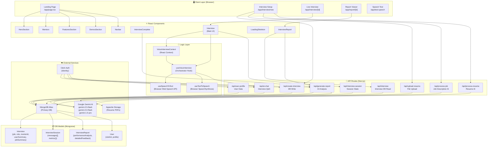
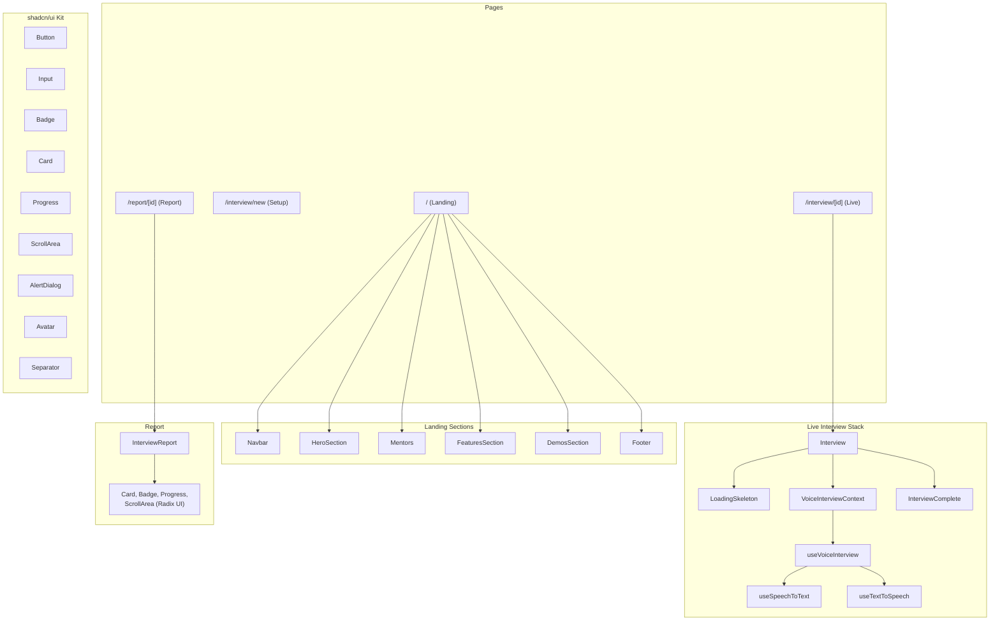
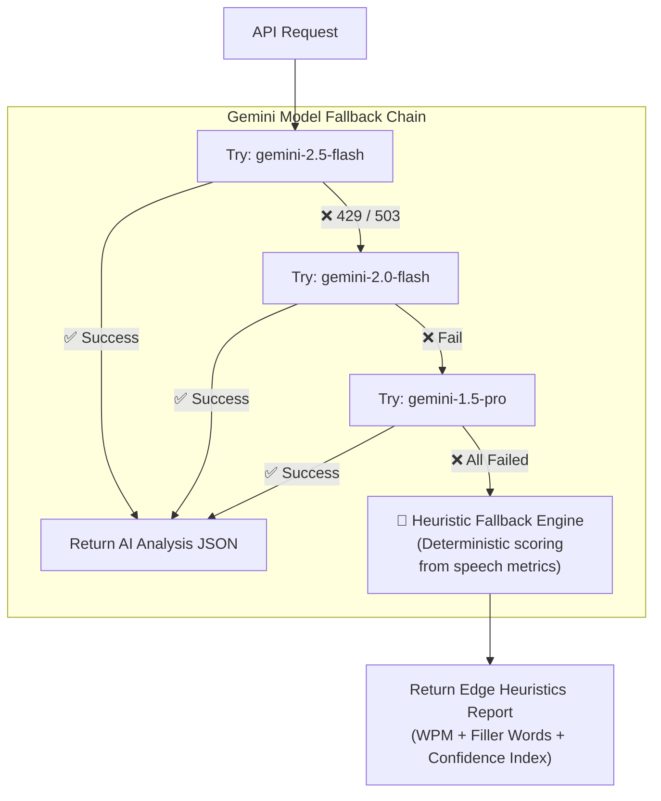
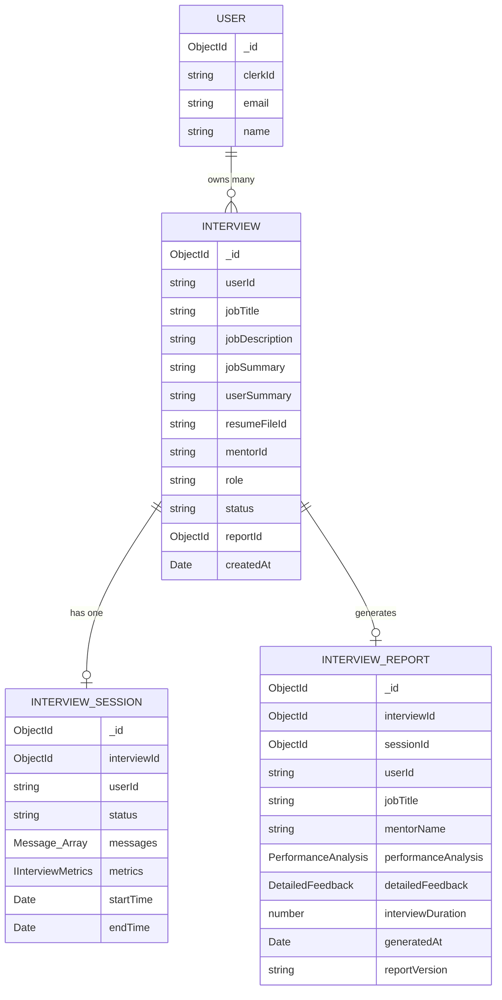
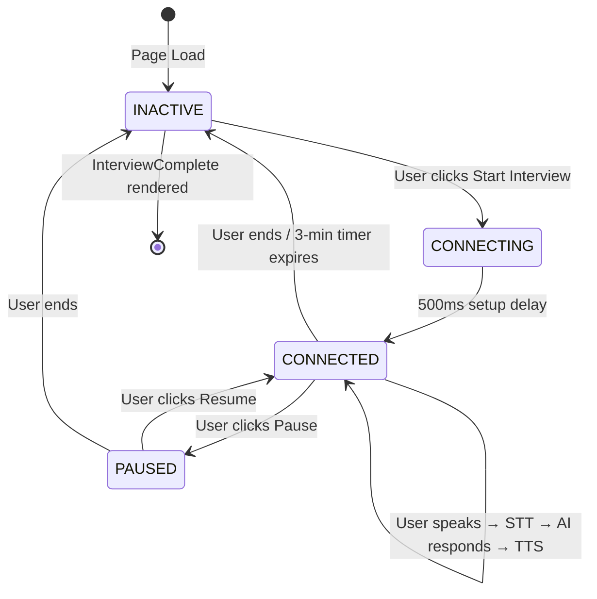

# 🧠 NexHack-Pro — Codebase Knowledge Graph

> **Project:** MockMentor AI Interview Platform  
> **Stack:** Next.js 15 · TypeScript · MongoDB Atlas · Appwrite · Clerk Auth · Gemini AI  
> **Generated:** 2026-04-14

---

## 📐 System Architecture



---

## 🔄 Full Interview Data Flow

```mermaid
sequenceDiagram
    actor User
    participant Page as Interview Setup Page
    participant ChatAPI as /api/ai-chat
    participant GeminiAI as Gemini AI
    participant SessionAPI as /api/interview-session
    participant ReportAPI as /api/generate-report
    participant MongoDB

    User->>Page: Upload Resume + Job URL
    Page->>+/api/upload-resume: PDF → Appwrite Storage
    /api/upload-resume-->>-Page: fileId
    Page->>+/api/process-resume: fileId → extract text
    /api/process-resume->>GeminiAI: Summarize Resume
    GeminiAI-->>+/api/process-resume: userSummary
    /api/process-resume-->>-Page: userSummary
    Page->>+/api/process-job: Job URL/desc
    /api/process-job->>GeminiAI: Summarize Job
    GeminiAI-->>+/api/process-job: jobSummary
    /api/process-job-->>-Page: jobSummary
    Page->>+/api/create-interview: role + summaries
    /api/create-interview->>MongoDB: Save Interview doc
    MongoDB-->>+/api/create-interview: interviewId
    /api/create-interview-->>-Page: interviewId

    User->>Page: Start Interview
    Page->>SessionAPI: POST action=start
    SessionAPI->>MongoDB: Create InterviewSession
    Page->>ChatAPI: START_INTERVIEW message
    ChatAPI->>GeminiAI: Generate welcome prompt
    GeminiAI-->>ChatAPI: Welcome message
    ChatAPI-->>Page: speakMessage()

    loop Each Q&A Round
        User->>Page: Speaks via mic (STT → text)
        Page->>ChatAPI: user text + conversation history
        ChatAPI->>GeminiAI: Next interview question
        GeminiAI-->>ChatAPI: question text
        ChatAPI-->>Page: TTS speaks question
        Page->>SessionAPI: POST action=add_message
        SessionAPI->>MongoDB: Append to messages[]
    end

    User->>Page: End Interview
    Page->>SessionAPI: POST action=end with metrics
    SessionAPI->>MongoDB: Save metrics{}
    Page->>ReportAPI: POST interviewId + sessionId
    ReportAPI->>MongoDB: Fetch Interview + Session
    ReportAPI->>GeminiAI: Full transcript + metrics → JSON analysis
    GeminiAI-->>ReportAPI: PerformanceAnalysis JSON
    ReportAPI->>MongoDB: Save InterviewReport
    ReportAPI-->>Page: Report data
    Page->>User: Show Report Viewer
```

---

## ⚛️ Component Hierarchy



---

## 🤖 AI Pipeline & Fallback Strategy



---

## 🗄️ Database Schema



---

## ⚡ State Machine — Voice Interview



---

## 🏗️ Project File Map

```
NexHack-Pro/
├── app/
│   ├── page.tsx                      # Landing page
│   ├── layout.tsx                    # Root layout (Clerk, Theme)
│   ├── globals.css                   # TailwindCSS v4 styles
│   ├── interview/
│   │   ├── new/                      # Interview setup wizard
│   │   └── [id]/                     # Live interview room
│   ├── report/                       # Report viewer page
│   ├── test-speech/                  # Speech API debug tool
│   └── api/
│       ├── ai-chat/                  # 🤖 Live interview Q&A (Gemini)
│       ├── generate-report/          # 📊 Post-interview AI analysis
│       ├── process-job/              # 💼 Job description summarizer
│       ├── process-resume/           # 📄 Resume text extractor
│       ├── upload-resume/            # 📁 PDF → Appwrite Storage
│       ├── create-interview/         # 🗃️ Interview DB creation
│       ├── interview/                # 🔍 Interview DB read
│       ├── interview-session/        # 💾 Session state management
│       └── user-profile/             # 👤 User data CRUD
│
├── components/
│   ├── interview.tsx                 # ⭐ Main live interview UI (567 lines)
│   ├── interview-complete.tsx        # Post-interview transition screen
│   ├── interview-report.tsx          # Full report visualization
│   ├── hero-section.tsx              # Landing hero with grid background
│   ├── mentors.tsx                   # AI mentor profiles & data
│   ├── features-section.tsx          # Feature showcase section
│   ├── demos-section.tsx             # Demo preview section
│   ├── loading-skeleton.tsx          # Shimmer loading state
│   ├── navbar.tsx                    # Navigation bar
│   ├── footer.tsx                    # Footer
│   ├── logic/
│   │   ├── VoiceInterviewContext.tsx # 🧠 Global AI state (Context + Provider)
│   │   ├── useVoiceInterview.ts      # 🎙️ Core orchestrator (STT+TTS+AI integration)
│   │   └── index.ts                  # Barrel exports
│   ├── ui/                           # shadcn/ui components (Radix primitives)
│   │   └── button, input, badge, card, progress,
│   │       avatar, scroll-area, separator, alert-dialog
│   └── magicui/                      # Animated UI utilities
│
├── hooks/
│   ├── useSpeechToText.ts            # 🎤 Web Speech API STT (5s silence timeout)
│   └── useTextToSpeech.ts            # 🔊 SpeechSynthesis TTS
│
├── lib/
│   ├── mongodb.ts                    # 🔌 Mongoose connection (globally cached)
│   ├── appwrite.ts                   # 📦 Appwrite Storage client
│   ├── appConfig.ts                  # App title / metadata
│   ├── utils.ts                      # Tailwind cn() merge utility
│   └── models/
│       ├── Interview.ts              # Mongoose schema
│       ├── InterviewSession.ts       # Mongoose schema + IInterviewMetrics
│       ├── InterviewReport.ts        # Mongoose schema (full AI output)
│       └── User.ts                   # Mongoose schema (Clerk integration)
│
├── model/                            # Python ML pipeline (standalone)
│   ├── new.py                        # Independent analysis script
│   ├── data/ & models/
│   └── requirements.txt
│
└── middleware.ts                     # Clerk Auth guard (protects all routes)
```

---

## 🔑 External Integrations

| Service | Purpose | SDK / Package |
|---|---|---|
| **Google Gemini AI** | Interview Q&A, report generation, resume/job summarization | `@ai-sdk/google`, `@google/generative-ai` |
| **Clerk** | Authentication, user management, JWT sessions | `@clerk/nextjs` |
| **MongoDB Atlas** | Primary persistent database (interviews, sessions, reports) | `mongoose` |
| **Appwrite Storage** | PDF resume file storage & retrieval | `appwrite` |
| **Browser Web Speech API** | Speech-to-Text (zero latency, no external API key) | native browser |
| **Browser SpeechSynthesis** | Text-to-Speech (zero latency, no external API key) | native browser |

---

## ⚡ Key Architectural Decisions

| Decision | Rationale |
|---|---|
| **Browser-native STT/TTS** | Zero-latency voice loop — no network round-trip to cloud speech APIs |
| **Gemini 3-model fallback chain** | Handles 429/503 rate limit errors gracefully without user-visible failures |
| **Heuristic fallback engine** | Last-resort deterministic report (WPM, filler words, confidence) when ALL Gemini models fail |
| **MongoDB mid-interview buffering** | Each message is persisted as it arrives — no data loss on crash or timeout |
| **Clerk server-side middleware guard** | All `/api/*` and `/interview/*` routes are protected at the edge |
| **VoiceInterviewContext decoupling** | AI state lives in context — `Interview.tsx` only reads, `useVoiceInterview.ts` writes |
| **Single unified Gemini prompt** | `generate-report` sends the full transcript + metrics in ONE request to avoid Vercel's 60s timeout |
| **`ahooks/useUnmount`** | Ensures camera tracks and voice sessions are properly torn down on component unmount |
