# MockMentor — Codebase Graph

> Auto-generated by `/graphify .` on 2026-05-16

---

## Architecture Overview

```mermaid
graph TD
    %% ─────────────────────────────────────────
    %% ENTRY POINTS
    %% ─────────────────────────────────────────
    subgraph "Next.js App Router"
        ROOT["app/page.tsx\n(Landing Page)"]
        LAYOUT["app/layout.tsx\n(Root Layout)"]
        INT_NEW["app/interview/new/page.tsx\n(New Interview)"]
        INT_ID["app/interview/[id]/page.tsx\n(Live Interview)"]
        RPT_ID["app/report/[id]/page.tsx\n(Report Viewer)"]
        TEST_SPEECH["app/test-speech/page.tsx\n(Speech Debug)"]
    end

    %% ─────────────────────────────────────────
    %% API ROUTES
    %% ─────────────────────────────────────────
    subgraph "API Layer  (app/api/)"
        API_UPLOAD["upload-resume\nroute.ts"]
        API_PROCESS_JOB["process-job\nroute.ts"]
        API_PROCESS_RESUME["process-resume\nroute.ts"]
        API_CREATE["create-interview\nroute.ts"]
        API_INTERVIEW["interview\nroute.ts"]
        API_SESSION["interview-session\nroute.ts"]
        API_AI_CHAT["ai-chat\nroute.ts"]
        API_REPORT["generate-report\nroute.ts"]
        API_USER["user-profile\nroute.ts"]
    end

    %% ─────────────────────────────────────────
    %% PAGE → API CALLS
    %% ─────────────────────────────────────────
    INT_NEW -->|"POST resume"| API_UPLOAD
    INT_NEW -->|"POST job desc"| API_PROCESS_JOB
    INT_NEW -->|"POST resume text"| API_PROCESS_RESUME
    INT_NEW -->|"POST setup"| API_CREATE
    INT_ID  -->|"GET/POST"| API_INTERVIEW
    INT_ID  -->|"GET/PATCH"| API_SESSION
    INT_ID  -->|"POST message"| API_AI_CHAT
    INT_ID  -->|"POST finish"| API_REPORT
    RPT_ID  -->|"GET report"| API_REPORT
    ROOT    -->|"GET profile"| API_USER

    %% ─────────────────────────────────────────
    %% COMPONENTS (Landing Page)
    %% ─────────────────────────────────────────
    subgraph "Landing Components  (components/)"
        NAVBAR["navbar.tsx"]
        HERO["hero-section.tsx"]
        FEATURES["features-section.tsx"]
        DEMOS["demos-section.tsx"]
        MENTORS["mentors.tsx"]
        FOOTER["footer.tsx"]
        MARQUEE["magicui/marquee.tsx"]
        SEC_HEAD["section-heading.tsx"]
    end

    ROOT --> NAVBAR
    ROOT --> HERO
    ROOT --> FEATURES
    ROOT --> DEMOS
    ROOT --> MENTORS
    ROOT --> FOOTER
    DEMOS --> MARQUEE
    FEATURES --> SEC_HEAD
    MENTORS --> SEC_HEAD

    %% ─────────────────────────────────────────
    %% INTERVIEW COMPONENTS
    %% ─────────────────────────────────────────
    subgraph "Interview Components"
        INTERVIEW_UI["interview.tsx\n(main interview shell)"]
        INT_COMPLETE["interview-complete.tsx\n(post-interview CTA)"]
        LOADING_SK["loading-skeleton.tsx"]
    end

    INT_ID --> INTERVIEW_UI
    INTERVIEW_UI --> INT_COMPLETE

    %% ─────────────────────────────────────────
    %% REPORT COMPONENTS
    %% ─────────────────────────────────────────
    subgraph "Report Components"
        INTERVIEW_RPT["interview-report.tsx\n(full report renderer)"]
    end

    RPT_ID --> INTERVIEW_RPT

    %% ─────────────────────────────────────────
    %% VOICE LOGIC (components/logic/)
    %% ─────────────────────────────────────────
    subgraph "Voice Logic  (components/logic/)"
        VOICE_CTX["VoiceInterviewContext.tsx\n(React Context)"]
        VOICE_HOOK["useVoiceInterview.ts\n(state machine)"]
        LOGIC_IDX["index.ts\n(barrel)"]
    end

    INTERVIEW_UI --> VOICE_CTX
    VOICE_CTX --> VOICE_HOOK

    %% ─────────────────────────────────────────
    %% BROWSER HOOKS
    %% ─────────────────────────────────────────
    subgraph "Hooks  (hooks/)"
        STT["useSpeechToText.ts\n(Web Speech API)"]
        TTS["useTextToSpeech.ts\n(SpeechSynthesis API)"]
    end

    VOICE_HOOK --> STT
    VOICE_HOOK --> TTS

    %% ─────────────────────────────────────────
    %% SHARED UI PRIMITIVES
    %% ─────────────────────────────────────────
    subgraph "Shadcn UI Primitives  (components/ui/)"
        BTN["button.tsx"]
        CARD["card.tsx"]
        BADGE["badge.tsx"]
        PROGRESS["progress.tsx"]
        AVATAR["avatar.tsx"]
        INPUT["input.tsx"]
        SCROLL["scroll-area.tsx"]
        SEPARATOR["separator.tsx"]
        ALERT_DLG["alert-dialog.tsx"]
    end

    INTERVIEW_UI --> BTN
    INTERVIEW_UI --> CARD
    INTERVIEW_UI --> BADGE
    INTERVIEW_UI --> PROGRESS
    INTERVIEW_UI --> AVATAR
    INTERVIEW_UI --> SCROLL
    INTERVIEW_UI --> ALERT_DLG
    INTERVIEW_RPT --> CARD
    INTERVIEW_RPT --> BADGE
    INTERVIEW_RPT --> PROGRESS
    INTERVIEW_RPT --> SEPARATOR

    %% ─────────────────────────────────────────
    %% LIB / BACK-END SERVICES
    %% ─────────────────────────────────────────
    subgraph "Lib  (lib/)"
        GEMINI["gemini.ts\n(Gemini AI client)"]
        GROQ["groq.ts\n(Groq fallback AI)"]
        APPWRITE["appwrite.ts\n(Auth / Storage)"]
        MONGODB["mongodb.ts\n(DB connection)"]
        PDF_LIB["pdf.ts\n(PDF parsing)"]
        PROMPT_HELPER["promptHelper.ts"]
        PROMPTS_JSON["prompts.json"]
        APP_CFG["appConfig.ts"]
        UTILS["utils.ts"]
    end

    subgraph "DB Models  (lib/models/)"
        M_INTERVIEW["Interview.ts"]
        M_REPORT["InterviewReport.ts"]
        M_SESSION["InterviewSession.ts"]
        M_USER["User.ts"]
    end

    %% API → Lib wiring
    API_UPLOAD       --> APPWRITE
    API_UPLOAD       --> PDF_LIB
    API_PROCESS_JOB  --> GEMINI
    API_PROCESS_JOB  --> GROQ
    API_PROCESS_RESUME --> GEMINI
    API_PROCESS_RESUME --> GROQ
    API_CREATE       --> MONGODB
    API_CREATE       --> M_INTERVIEW
    API_INTERVIEW    --> MONGODB
    API_INTERVIEW    --> M_INTERVIEW
    API_SESSION      --> MONGODB
    API_SESSION      --> M_SESSION
    API_AI_CHAT      --> GEMINI
    API_AI_CHAT      --> GROQ
    API_AI_CHAT      --> PROMPT_HELPER
    API_REPORT       --> GEMINI
    API_REPORT       --> GROQ
    API_REPORT       --> MONGODB
    API_REPORT       --> M_REPORT
    API_USER         --> MONGODB
    API_USER         --> M_USER

    PROMPT_HELPER    --> PROMPTS_JSON
    GEMINI           --> APP_CFG
    GROQ             --> APP_CFG

    %% ─────────────────────────────────────────
    %% PYTHON ML SIDECAR  (model/)
    %% ─────────────────────────────────────────
    subgraph "Python ML Sidecar  (model/)"
        PY_MAIN["new.py\n(ML pipeline entry)"]
        PY_DATA["data/\n(datasets)"]
        PY_MODELS["models/\n(trained artifacts)"]
    end

    PY_MAIN --> PY_DATA
    PY_MAIN --> PY_MODELS

    %% ─────────────────────────────────────────
    %% MIDDLEWARE / CONFIG
    %% ─────────────────────────────────────────
    subgraph "Config & Infra"
        MIDDLEWARE["middleware.ts\n(Auth guard)"]
        NEXT_CFG["next.config.ts"]
        PKG["package.json"]
        TSCONFIG["tsconfig.json"]
        ENV["env.local / env.example"]
        THEME["components/theme-provider.tsx"]
    end

    LAYOUT --> THEME
    MIDDLEWARE --> APPWRITE
```



---

## Directory Tree

```
MockMentor/
├── app/
│   ├── layout.tsx                  ← Root layout + font + theme
│   ├── page.tsx                    ← Landing page
│   ├── globals.css
│   ├── interview/
│   │   ├── new/page.tsx            ← Interview setup wizard
│   │   └── [id]/page.tsx           ← Live interview session
│   ├── report/
│   │   └── [id]/page.tsx           ← Report viewer
│   ├── test-speech/page.tsx        ← Speech API debug page
│   └── api/
│       ├── upload-resume/          ← Appwrite file upload + PDF parse
│       ├── process-job/            ← Gemini/Groq job description analysis
│       ├── process-resume/         ← Gemini/Groq resume analysis
│       ├── create-interview/       ← MongoDB interview record creation
│       ├── interview/              ← Interview fetch/update
│       ├── interview-session/      ← Session state management
│       ├── ai-chat/                ← Real-time AI question generation
│       ├── generate-report/        ← Post-interview report synthesis
│       └── user-profile/           ← User data CRUD
│
├── components/
│   ├── ui/                         ← Shadcn/Radix primitives
│   │   ├── button.tsx, card.tsx, badge.tsx, progress.tsx
│   │   ├── avatar.tsx, input.tsx, scroll-area.tsx
│   │   ├── separator.tsx, alert-dialog.tsx
│   ├── magicui/
│   │   └── marquee.tsx             ← Animated logo marquee
│   ├── logic/                      ← Voice interview state machine
│   │   ├── VoiceInterviewContext.tsx
│   │   ├── useVoiceInterview.ts
│   │   └── index.ts
│   ├── navbar.tsx
│   ├── hero-section.tsx
│   ├── features-section.tsx
│   ├── demos-section.tsx
│   ├── mentors.tsx
│   ├── footer.tsx
│   ├── interview.tsx               ← Main interview UI shell
│   ├── interview-complete.tsx      ← Post-interview screen
│   ├── interview-report.tsx        ← Full report renderer
│   ├── loading-skeleton.tsx
│   ├── section-heading.tsx
│   └── theme-provider.tsx
│
├── hooks/
│   ├── useSpeechToText.ts          ← Web Speech API (STT)
│   └── useTextToSpeech.ts          ← SpeechSynthesis API (TTS)
│
├── lib/
│   ├── gemini.ts                   ← Gemini 2.5 Flash AI client
│   ├── groq.ts                     ← Groq fallback AI client
│   ├── appwrite.ts                 ← Appwrite auth & storage
│   ├── mongodb.ts                  ← Mongoose connection
│   ├── pdf.ts                      ← PDF text extraction
│   ├── promptHelper.ts             ← Prompt builder utilities
│   ├── prompts.json                ← All AI prompt templates
│   ├── appConfig.ts                ← Global app config
│   ├── utils.ts                    ← Shared utilities
│   └── models/
│       ├── Interview.ts
│       ├── InterviewReport.ts
│       ├── InterviewSession.ts
│       └── User.ts
│
├── model/                          ← Python ML sidecar
│   ├── new.py
│   ├── data/
│   └── models/
│
├── middleware.ts                   ← Appwrite auth guard (Next.js edge)
├── next.config.ts
├── package.json
└── tsconfig.json
```

---

## Data Flow Summary

| Phase | User Action | Client | API Route | Service |
|---|---|---|---|---|
| **Setup** | Upload resume | `interview/new` | `upload-resume` | Appwrite + PDF parser |
| **Setup** | Paste job URL/desc | `interview/new` | `process-job` | Gemini → Groq fallback |
| **Setup** | Submit form | `interview/new` | `process-resume` + `create-interview` | Gemini → Groq, MongoDB |
| **Interview** | Session start | `interview/[id]` | `interview-session` | MongoDB |
| **Interview** | Speak answer | `useVoiceInterview` → STT hook | `ai-chat` | Gemini → Groq fallback |
| **Interview** | Hear question | TTS hook | — | SpeechSynthesis API |
| **Finish** | End interview | `interview/[id]` | `generate-report` | Gemini → Groq, MongoDB |
| **Review** | View report | `report/[id]` | `generate-report GET` | MongoDB |

---

> **Ignored:** `node_modules/`, `dist/`, `vendor/`, `*.generated.py`, `.next/`, `.git/`
